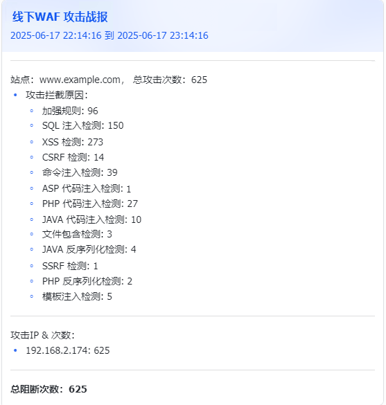

# 感恩的心

感谢雷池官方对本项目的支持，PY了好几天的专业版，不然syslog 真没法写

# 槽

官方的好用吗？

# WAF 攻击告警脚本

这是一套用于从长亭雷池 WAF 中获取指定时间段内的攻击日志，并将汇总后的“攻击战报”发送到指定的告警渠道（目前支持飞书/钉钉）。

## 功能特性

-   **数据拉取**：通过 WAF 的开放 API 拉取攻击记录。
-   **时间自定义**：支持查询过去N小时或N分钟的日志。
-   **时间取整**：可将查询的开始和结束时间进行取整，便于定时任务执行。
-   **多渠道告警**：支持将报告发送到多个飞书群组。
-   **灵活配置**：通过 `YAML` 文件管理所有 WAF 实例和告警渠道，易于扩展。
-   **调试模式**：提供 `--debug` 选项，输出详细的执行日志，方便排查问题。
-   **实时波动告警**：通过 `--spike` 选项，实时检测攻击波动，当检测到异常波动时，自动发送告警。

## 效果
### 飞书



### 钉钉


## 安装

当前已使用 `uv` 进行项目管理，git clone 项目后，直接运行 `uv venv` 创建虚拟环境，然后运行 `uv sync` 安装依赖即可。

1. 克隆或下载本仓库到您的本地。
2. 安装所需的 Python 依赖库。建议使用虚拟环境。

```bash
uv venv
uv sync
```

## 配置

首先，查看官方文档，获取waf token。
[获取token](https://help.waf-ce.chaitin.cn/node/01973fc6-e25e-7eda-8ea8-dae97bdd4213)

所有配置均在 `config/default.yaml` 文件中定义。您可以复制该文件并重命名（例如 `my_config.yaml`）来进行个性化配置。

### 配置文件示例 (`config/default.yaml`)

```yaml
# WAF 实例列表
waf:
  - name: "官网WAF"  # WAF实例的友好名称
    address: "https://192.168.1.1:9443" # WAF的管理地址
    token: "your-api-token-here" # 从WAF获取的API Token
    alert: true # 是否为该WAF实例发送告警
    show_attack_ip_top: 5 # 显示攻击IP前几名, 为0的时候不显示
    sendto: # 告警渠道列表，对应下方 alert_channels 中定义的名称
      - "安全部-飞书群"
      - "研发部-飞书群"
    ignore_rule:
      - "长亭社区恶意 IP 情报黑名单" # 忽略的规则名称，规则名字一般是你自己写的
      - "m_sqli" # 有些是模块，得去waf_module_dict.py 里找，比如这样，就是忽略SQL注入模块

# 告警渠道配置
alert_channels:
  # 飞书机器人列表
  feishu:
    - name: "安全部-飞书群" # 渠道的唯一名称
      token: "your-feishu-bot-token-1" # 飞书机器人的Webhook Token
      secret: "your-feishu-bot-secret-1" # 飞书机器人的签名密钥

    - name: "研发部-飞书群"
      token: "your-feishu-bot-token-2"
      secret: "your-feishu-bot-secret-2"

  # 钉钉机器人列表
  dingtalk:
    - name: "钉钉测试群"
      token: "your-dingtalk-bot-token"
      secret: "your-dingtalk-bot-secret"

  # 微信机器人列表
  wechat:
    - name: "微信测试群"
      token: "your-wechat-bot-token"

# syslog 配置
syslog:
  listen_ip: "0.0.0.0"
  listen_port: 514
  sendto:
  - 钉钉测试群

# 波动检测配置
spike_detection:
  window_minutes: 3        # 统计滑动窗口大小（分钟）
  min_events: 10           # 激增判定时，当前分钟最少攻击数
  std_times: 2             # 当前分钟攻击数 > 均值+N*标准差时告警
  check_interval: 10       # 检查激增的秒数间隔
```

## 使用方法
### 运行

通过命令行运行 `python main.py --help` 查看帮助信息。

### 命令行参数

-   `-H, --hour`：查询过去多少小时的日志（默认: 1）。
-   `-M, --minute`：查询过去多少分钟的日志。此参数优先级高于 `--hour`。
-   `-r, --round`：是否对时间进行取整。
-   `-c, --config`：指定配置文件的路径（默认: `config/default.yaml`）。
-   `--spike`：启动波动检测告警。
-   `--debug`：开启调试模式，输出更详细的日志。

### 使用示例

-   **默认运行** (查询过去1小时的日志):
    ```bash
    python main.py
    ```

-   **查询过去30分钟的日志**:
    ```bash
    python main.py -M 30
    ```

-   **查询过去2小时的日志，并对时间进行取整**:
    ```bash
    python main.py -H 2 -r
    ```

-   **使用自定义配置文件并开启调试模式**:
    ```bash
    python main.py -c config/my_config.yaml --debug
    ```

-   **启动实时波动告警**:
    ```bash
    python main.py --spike
    ```

## 波动告警说明
- **注意**：waf 的syslog 外发是付费功能！！！
- **注意**：waf 的syslog 外发是付费功能！！！
- **注意**：waf 的syslog 外发是付费功能！！！

波动告警是基于waf 往syslog 服务器推送消息的，所以一旦使用--spike，会启动一个syslog监听线程

告警配置有点抽象，所以搞点示例说明

```yaml
spike_detection:
  window_minutes: 3        # 统计滑动窗口大小（分钟）
  min_events: 10           # 激增判定时，当前分钟最少攻击数
  std_times: 2             # 当前分钟攻击数 > 均值+N*标准差时告警
  check_interval: 10       # 检查激增的秒数间隔
```
- 只要“当前1分钟的攻击数”大于“前2分钟的平均 + 2倍标准差”，并且当前分钟攻击数 ≥ 10，就会告警。
- 每10秒检查一次

|时间（分钟）|攻击数|
|:---:|:---:|
|第1分钟|12|
|第2分钟|8|
|第3分钟（当前）|35|

- 前两分钟均值 = (12+8)/2 = 10
- 前两分钟标准差 = sqrt(((12-10)^2 + (8-10)^2)/2) = sqrt((4+4)/2) = sqrt(4) = 2
- 告警阈值 = 10 + 2*2 = 14
- 当前分钟攻击数 = 35，且 ≥ 10，且 35 > 14，会触发告警。


[官方文档 syslog](https://help.waf-ce.chaitin.cn/node/01973fc6-e276-7c80-85ec-70b5d5863d60)

## 待办事项 (TODO)

-   [X] 实现钉钉告警渠道的发送逻辑。
-   [X] 实现微信告警渠道的发送逻辑。（注意作者没有企业微信，照着微信官方文档盲敲的，应该可以正常工作，但是没有测试）
-   [X] 使用UV进行项目管理。
-   [X] 添加show_attack_ip_top参数，用于显示攻击IP。
-   [X] 添加ignore_rule参数，用于忽略某些规则。
-   [X] 基于syslog实现实时波动告警。
-   [ ] 实现更强大的syslog 告警，告警内容参考截图。
-   [ ] 重构波动告警，或许会抛弃syslog，改用waf的api。
-   [ ] 波动告警联动黑名单实时封禁扫最high的IP。
-   [ ] 添加多语言支持（重要但不紧急）。